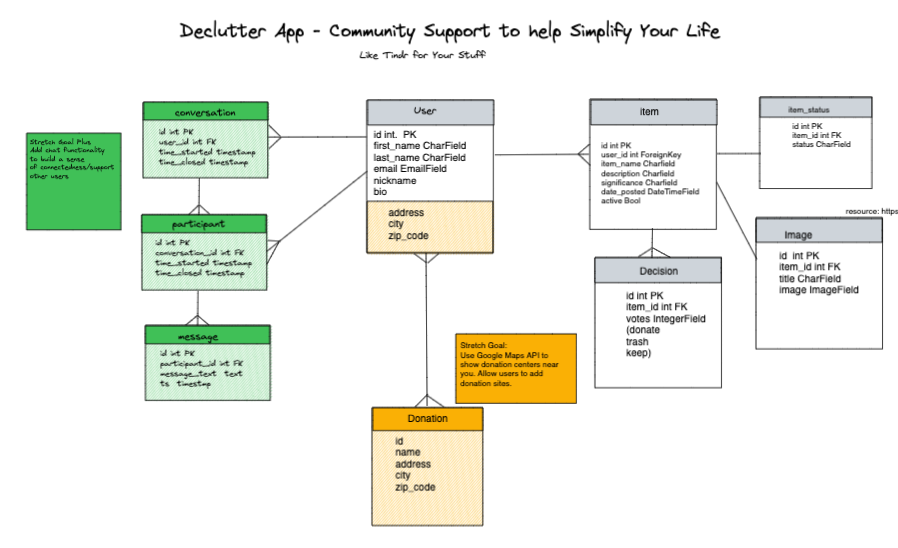

# Simplihive

Simplify your home, simplify your life.

Python Django PostgreSQL application designed to add a social element (hive mind to combat decision fatigue) to decluttering your home.


## Description

Users will be able to login and post items that they are unsure of getting rid of. Users can upload a picture of the item. Users can vote on other users' items - donate, trash, or keep. After time period TBD, user can update the community with the item status - whether they chose to take the community advice or not.  

Stretch Goal 1: Users can search for donation locations near them. Users can add Donation sites to the database. Users can leave reviews for donation sites.

Stretch Goal 2: Users can chat with each other and support each other through the decluttering process.
---


## Getting Started

### Dependencies

```
pip install Pillow
```


### Installing

* Fork and clone the repository here
* Create a .env file


### Executing program

* Install Python/Django (if you do not have already)
```
brew install python3
pip3 install ipython
pip3 install django
```
* Run database migration
```
python3 manage.py makemigrations
python3 manage.py migrate
```
* Create admin (superuser)
```
python3 manage.py createsuperuser
```
* Run server
```
python3 manage.py runserver
```
You should be able to access the app through localhost and admin through localhost/admin
## Help

If you forget the password for your admin (superuser account), run the following command in your terminal
```
python3 manage.py changepassword <user_name>
```

## Authors

Contributors names and contact info

Catherine Wheeler-Mushlin
[@wordsbycat](https://twitter.com/wordsbycat)

## Version History

* 0.1
    * Initial Release

## License

This project is licensed under the GNU Free Documentation License - see the LICENSE.md file for details

## Acknowledgments

Inspiration, code snippets, etc.
* [Videos from Codemy.com](https://www.youtube.com/@Codemycom)
* [Colorscheme Info](https://hookagency.com/blog/website-color-schemes/)
* [Django Documentation](https://docs.djangoproject.com/en/4.1/)
* [Django Create App](https://docs.djangoproject.com/en/4.1/intro/tutorial01/)
* [Python 3.11 Documentation](https://docs.python.org/3/)